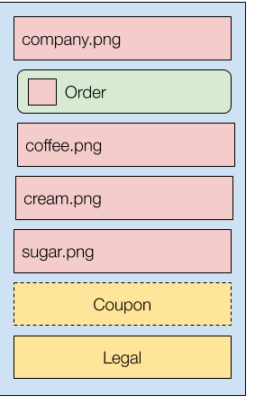

# 🏗️ View

```toml
[dependencies]
view = "0.2"
```
Constructing view heirarchies in Rust is a bit tedious. This is a macro for constructing views in a non framework specific manner. It's more struct oriented compared to a technology like JSX and borrows in broad strokes some ideas from SwiftUI.

This example shows everything that's possible
```rust
let images = vec!["coffee.png","cream.png","sugar.png"];
let show_coupon = false;
​
let v = view!{
  VStack {
    Image("company.png") 
    Button(text:"order".to_string(),style:BOLD)
      .on_click(|| do_order()) { 
        Image("order_icon.png") 
      }
    For(i in images.iter()) { Image(i) }
    If(show_coupon) { Coupon }
    Legal
  }
};
```

<p align="center">

</p>

Below is all the code this macro saves you from writing yourself.

```rust
let images = <[_]>::into_vec(box ["coffee.png", "cream.png", "sugar.png"]);
let show_legal = false;

let s = {
    let mut o = VStack {
        ..Default::default()
    };
    o.construct({
        let mut c = Vec::<Box<View>>::new();
        c.push(Box::new({ Image::new("company.png") }));
        c.push(Box::new({
            let mut o = Button {
                text: "order".to_string(),
                style: BOLD,
                ..Default::default()
            };
            o.on_click(|| do_order());
            o.on_click(|| do_order());
            o.construct({
                let mut c = Vec::<Box<View>>::new();
                c.push(Box::new({ Image::new("order_icon.png") }));
                c
            });
            o
        }));
        for i in images.iter() {
            c.append(&mut {
                let mut c = Vec::<Box<View>>::new();
                c.push(Box::new({ Image::new(i) }));
                c
            });
        }
        c.push(Box::new({
            Footer {
                ..Default::default()
            }
        }));
        if show_legal {
            c.append(&mut {
                let mut c = Vec::<Box<View>>::new();
                c.push(Box::new({
                    Legal {
                        ..Default::default()
                    }
                }));
                c
            })
        }
        c
    });
    o
};
{
    match (&6, &s.children.len()) {
        (left_val, right_val) => {
            if !(*left_val == *right_val) {
                {
                    ::std::rt::begin_panic_fmt(&::core::fmt::Arguments::new_v1(
                        &[
                            "assertion failed: `(left == right)`\n  left: `",
                            "`,\n right: `",
                            "`",
                        ],
                        &match (&&*left_val, &&*right_val) {
                            (arg0, arg1) => [
                                ::core::fmt::ArgumentV1::new(arg0, ::core::fmt::Debug::fmt),
                                ::core::fmt::ArgumentV1::new(arg1, ::core::fmt::Debug::fmt),
                            ],
                        },
                    ))
                }
            }
        }
    }
};
```

This project isn't framework specific, but it does have a few rules:
* components must implement a trait `View` if you want it stored as a container component
* views that have children must have a function `fn construct(&mut self, children:Vec<Box<View>>)` implemented 
* views must implement Default trait for property construction (e.g `Button(text:"click me".to_owned())` )
* views must have a 'new' constructor function for simple construction (e.g `Button("click me")` )

Here's a basic example of implementing these rules, though they can be implemented in any way you choose.

```rust

trait View {}

#[derive(Default)]
struct VStack {
  direction: u8,
  children: Vec<Box<View>>
}

impl VStack {
  fn new(direction:u8) -> Self {
    VStack{ direction:direction, children:vec![] }
  }
  
  fn construct(&mut self, children:Vec<Box<View>>) { 
    self.children = children.unwrap();
  }
}

impl View for VStack {}

#[derive(Default)]
struct Button {
  text:String
}

impl Button {
  fn new(text:String) -> Self {
    Button{text:text}
  }
  
  fn construct(&mut self, children:Vec<Box<View>>) {}
}

impl View for Button {}
```

# License

This project is licensed under either of

 * Apache License, Version 2.0, ([LICENSE-APACHE](LICENSE-APACHE) or
   http://www.apache.org/licenses/LICENSE-2.0)
 * MIT license ([LICENSE-MIT](LICENSE-MIT) or
   http://opensource.org/licenses/MIT)

at your option.

### Contribution

Unless you explicitly state otherwise, any contribution intentionally submitted
for inclusion in view by you, as defined in the Apache-2.0 license, shall be
dual licensed as above, without any additional terms or conditions.
